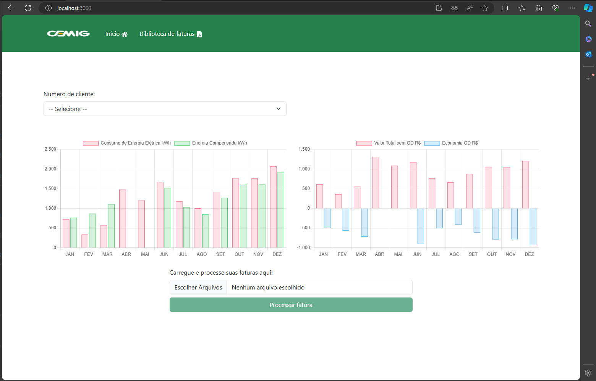

## Aplicação Faturas Cemig - Teste Prático Lumi

### Sobre a aplicação

A aplicação consiste em faturas da cemig que esta em pdf e captar dados relavantes, realizando persistencia dos mesmo no banco de dados postgres SQL e apresentar resultados em graficos!

### Vídeo de apresentação do projeto

https://www.loom.com/share/9811b52debc94447bc27354365c9c963

## Instruções para rodar a aplicação em docker

- Na raiz do projeto execute o comando: **docker-compose up --build** para subir os contêiner

### Uso de Migrate

- Foi criado migrate para as tabelas necessárias (execute os comandos dentro do contêiner api usando o comando de acesso **docker exec -it api bash** assim que os conteiner subirem)
  - npx sequelize-cli db:migrate

### Testes Unitários

- Para execução dos testes unitários, caso ainda esteja dentro do container execute o comando abaixo ou acesse o contêiner 'api' usando o comando **docker exec -it api bash** e dentro do container execute:
  - npm run test

### Algumas das tecnologias e bibliotecas utilizadas

- ### Express
- ### Typescript
- ### React
- ### Postgres
- ### ChartJs
- ### Jest
- ### Pdf-Parse
- ### Docker

### Endereços da aplicação:
- Projeto Front localhost:3000 
- Projeto Api   localhost:3001

### Rotas da aplicação

### POST http://localhost:3001/api/process-pdf

- Upload e processamento de pdf
- Formulario formdata, propriedade "files"

### GET http://localhost:3001/api/list-all-invoices

- Listar todas as faturas

### GET http://localhost:3001/api/list-all-customers

- Listar todas os clientes

### GET http://localhost:3001/api/download/path/:file

- Realiza download de fatura

### GET http://localhost:3001/api/list-dash-energy-consumed

- Listar dashboard referente ao consumo eletrico

### GET http://localhost:3001/api/list-dash-energy-economy

- Listar dashboard referente a economia eletrica
